# COM7019 — Stock price forecasting with neural networks

**Arden University** · MSc Data Science · Module **COM7019** (Artificial Intelligence and Neural Networks)  
**Student ID:** 25199053

Public code, frozen results, and the submitted portfolio PDF for COM7019.

---

## What this project is

The brief asked for a deep-learning investigation of short-term stock forecasting on one authorised historical dataset (`Stock_Price_Data_[3921].csv`).

In plain terms:

1. Can yesterday’s prices help predict tomorrow’s Adjusted Close?
2. Between the two required models, **LSTM** and **GRU**, which is more suitable here?
3. Do sensible experiments (depth, dropout, lookback window, learning rate, fine-tuning) change that answer?
4. As an extra check, does a simple **CNN-LSTM hybrid** beat the recurrent baselines under the same rules?

---

## What was done

- Loaded and checked the authorised CSV (no missing values, chronological order).
- Split the series by time (70% train / 15% validation / 15% test) so the future never leaks into training.
- Built sliding windows with per-window normalisation, then scored every model against a **persistence baseline** (tomorrow = today).
- Trained LSTM and GRU variants, plus a CNN-LSTM hybrid, with early stopping.
- Ran ablations: dropout on/off, lookback **1W / 1M / 1Y** trading days, lower learning rate, and hybrid fine-tuning.
- Froze metrics, architecture diagrams, and comparison charts into `results/` from a full Colab run.

---

## Headline results (frozen Colab run)

| Model | Test RMSE |
|-------|----------:|
| CNN-LSTM hybrid | **3.2277** |
| Best GRU (LR = 0.0001) | 3.2339 |
| Persistence baseline | 3.2380 |

**Takeaway:** the hybrid is slightly best; gains over persistence are small. Among the required architectures, **GRU** is the practical choice: almost the same accuracy as LSTM, with fewer parameters and less training time.

Full table: [`results/tables/results_all_runs.csv`](results/tables/results_all_runs.csv)

---

## Key figures (guide)

All frozen images live in [`results/figures/`](results/figures/). Below is a short tour of the main ones.

### Data and split

**Candlestick (last 60 days)** — recent price action with moving averages; useful for a business view of short-term path and volatility.

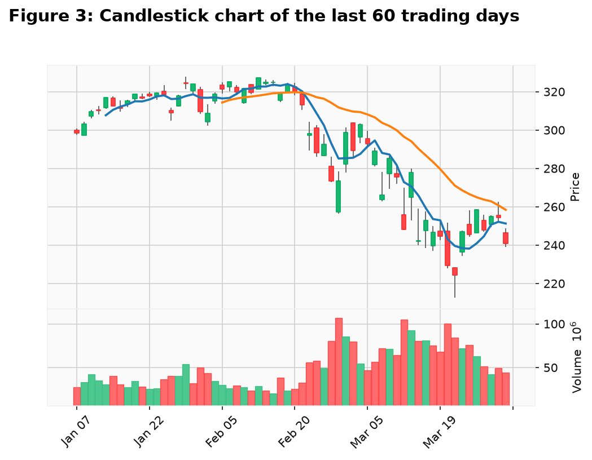

**March 2020 zoom** — the test window includes a real crash regime, not only calm growth.

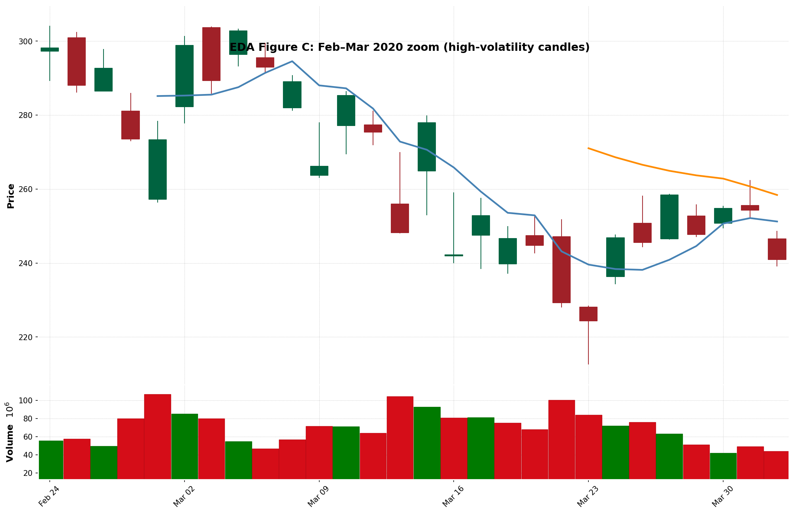

**Train / validation / test on Adjusted Close** — chronological 70/15/15 split so future days never leak into training.

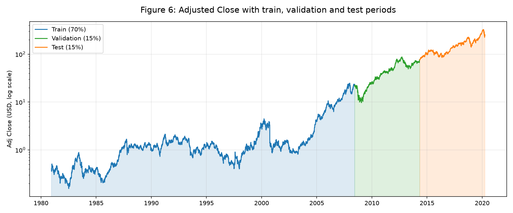

### Model architectures

**One-layer LSTM** — required recurrent baseline (64 units, dropout 0.2, 21-day window).

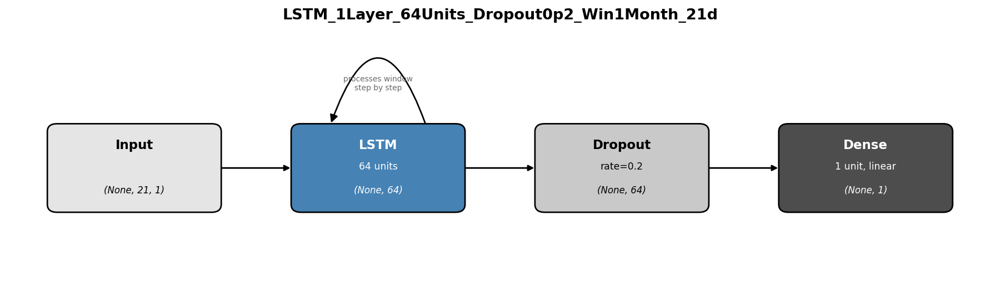

**One-layer GRU** — same protocol, fewer parameters than the matching LSTM.

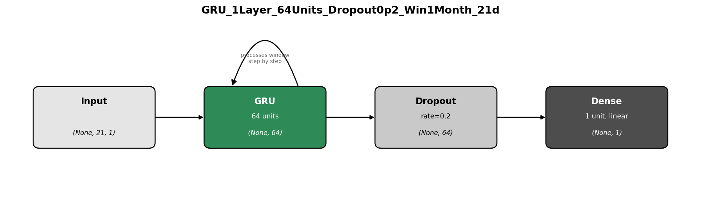

**CNN-LSTM hybrid** — optional extension: Conv1D front-end, then LSTM.

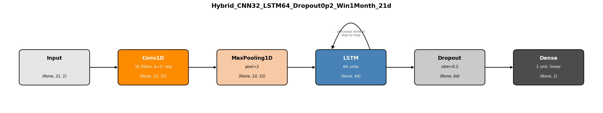

### Experiments and comparison

**Window ablation** — 1M (21 trading days) beat 1W and 1Y on test RMSE for the no-dropout GRU.

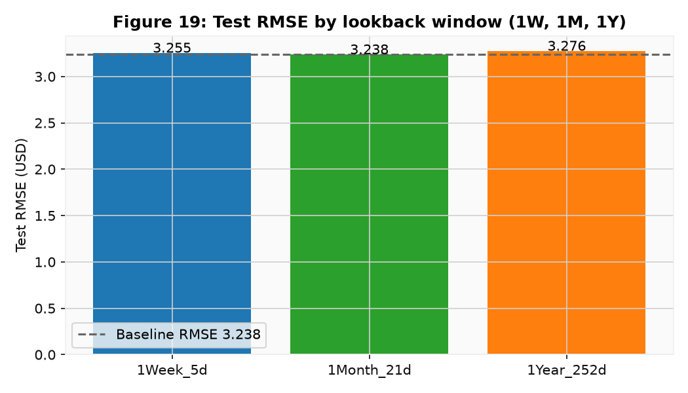

**Loss curves (log scale)** — training and validation MSE for the main LSTM, GRU, and hybrid runs.

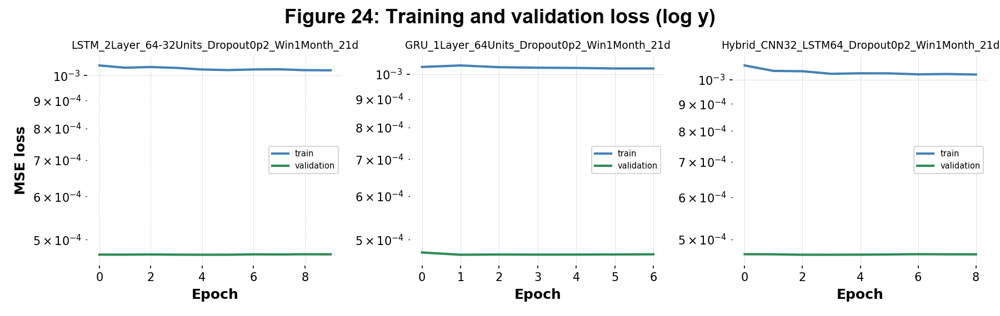

**Zoomed accuracy** — test RMSE, MAE and MAPE by model; green bars beat persistence, red bars do not.

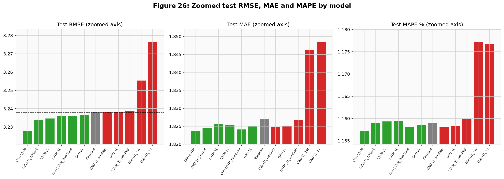

**Delta versus baseline** — change in test RMSE relative to persistence (negative is better).

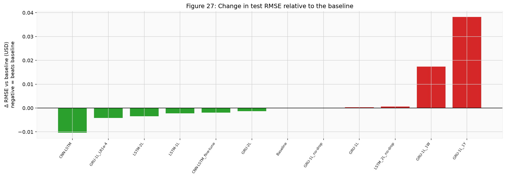

**Rank heatmap** — multi-criteria ranks across accuracy and cost.

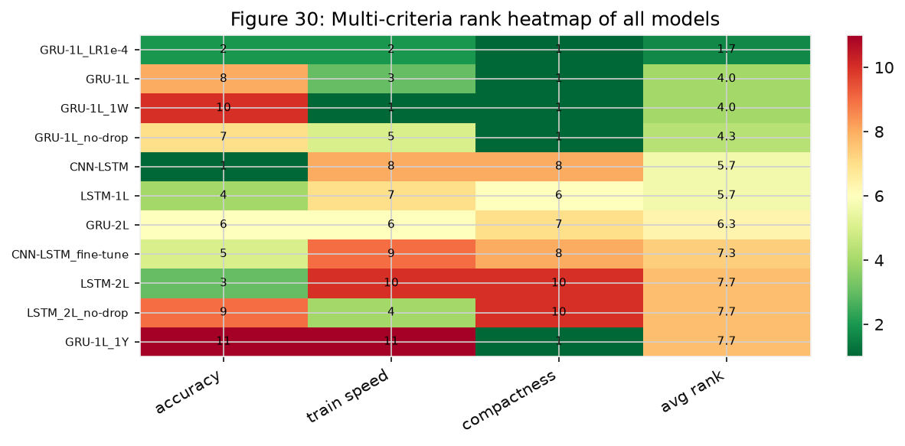

### Predictions

**Predicted vs actual (final test year)** — curves look close, but forecasts largely lag by about one day (refined persistence).

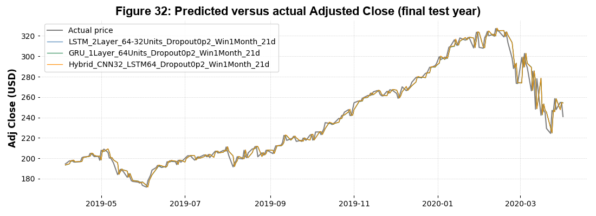

More figures in the same folder: October 2019–April 2020 candlestick, two-layer LSTM/GRU diagrams, linear loss curves, training-time/parameter cost, and business-efficiency plots.

---

## Repository layout

```text
report/      Submitted portfolio PDF
data/        Authorised dataset from the brief
notebook/    Main Colab/Jupyter notebook (run this)
results/     Frozen figures, tables, and model summaries
src/         Small helper package used by the notebook
docs/        Short methodology note
```

- Submitted report: [`report/COM7019_Portfolio_25199053.pdf`](report/COM7019_Portfolio_25199053.pdf)
- Main notebook: [`notebook/COM7019_25199053.ipynb`](notebook/COM7019_25199053.ipynb)

---

## How to reproduce

### Google Colab (recommended)

1. Upload `notebook/COM7019_25199053.ipynb` and `data/Stock_Price_Data_[3921].csv`.
2. Runtime → **Run all**.
3. Optional: download any new `output/` folder if you regenerate local copies.

### Local

```bash
python -m venv .venv
source .venv/bin/activate
pip install -r requirements.txt
pip install -e .
cp data/Stock_Price_Data_[3921].csv notebook/
jupyter notebook notebook/COM7019_25199053.ipynb
```

Full training is slow on CPU; Colab with GPU is easier.

---

## Licence

MIT for the code in this repository. The CSV is supplied for the COM7019 assessment; keep academic-use context in mind if you reuse it.
